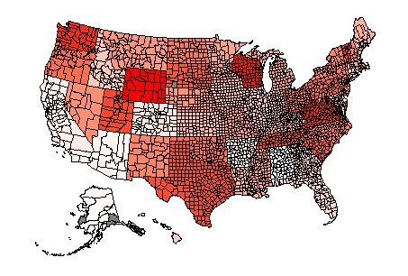

# Look up FIA survey unit names by county

A lookup table with Forest Inventory and Analysis survey unit names and counties. Values can be found in the [FIA Database Users Guide](https://www.fia.fs.usda.gov/library/database-documentation/current/ver90/FIADB%20User%20Guide%20P2_9-0-1_final.pdf), Appendix B).
